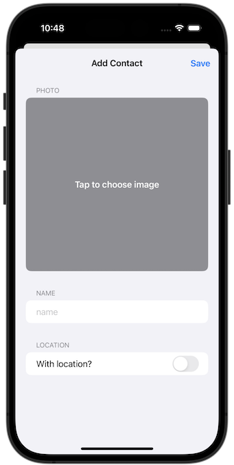
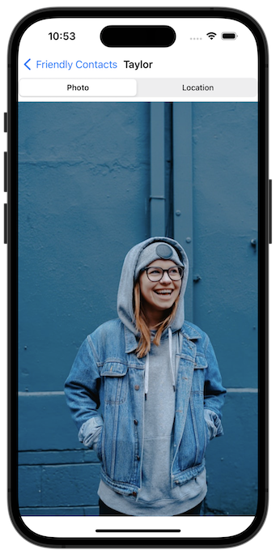
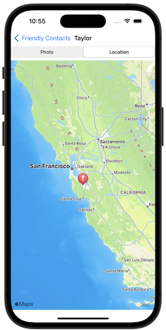
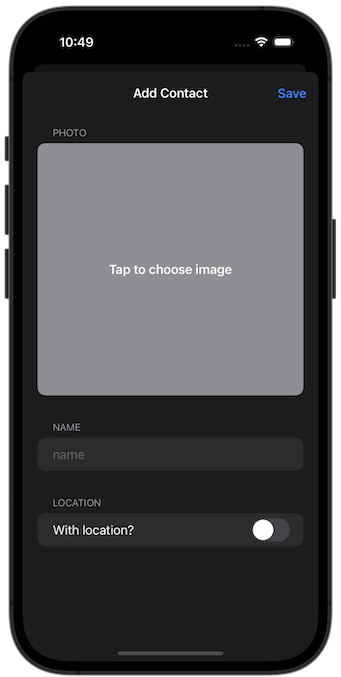
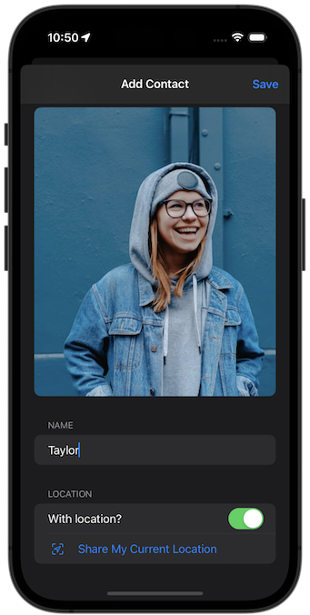
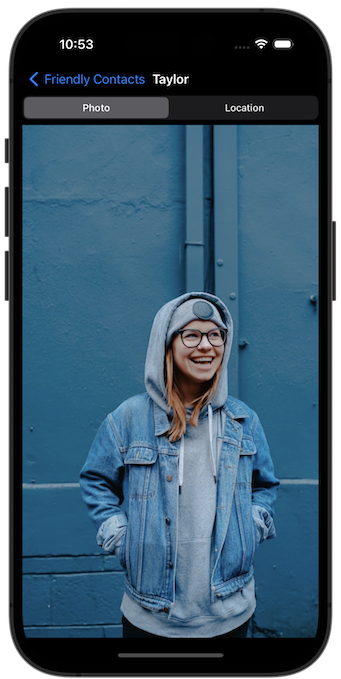
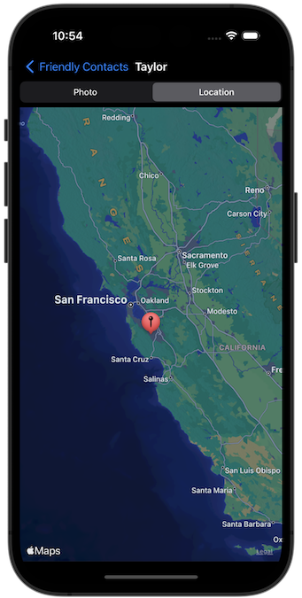

# Milestone Projects 13-15 - Friendly Contacts

https://www.hackingwithswift.com/100/swiftui/77 and https://www.hackingwithswift.com/100/swiftui/78

### Note

Both File system and Core Data implementations are provided. See Implementation.swift in "Model" to switch from one to the other.

### Topics

This milestone project is in 2 parts:

- Part1 allows adding a contact from a picture in the photo library, displaying a list of contacts, and displaying details of a contact
- Part2 adds retrieving and storing location when the contact is added, displaying location on a map

### Credits

Photo by [Michael Dam](https://unsplash.com/@michaeldam?utm_source=unsplash&utm_medium=referral&utm_content=creditCopyText) on [Unsplash](https://unsplash.com/photos/mEZ3PoFGs_k?utm_source=unsplash&utm_medium=referral&utm_content=creditCopyText) 
Photo by [ian dooley](https://unsplash.com/@sadswim?utm_source=unsplash&utm_medium=referral&utm_content=creditCopyText) on [Unsplash](https://unsplash.com/photos/d1UPkiFd04A?utm_source=unsplash&utm_medium=referral&utm_content=creditCopyText) 
Photo by [Toa Heftiba](https://unsplash.com/@heftiba?utm_source=unsplash&utm_medium=referral&utm_content=creditCopyText) on [Unsplash](https://unsplash.com/photos/O3ymvT7Wf9U?utm_source=unsplash&utm_medium=referral&utm_content=creditCopyText) 
Photo by [Joseph Gonzalez](https://unsplash.com/es/@miracletwentyone?utm_source=unsplash&utm_medium=referral&utm_content=creditCopyText) on Photo by [Unsplash](https://unsplash.com/photos/iFgRcqHznqg?utm_source=unsplash&utm_medium=referral&utm_content=creditCopyText) 
Photo by [Eric Lucatero](https://unsplash.com/@erik_lucatero?utm_source=unsplash&utm_medium=referral&utm_content=creditCopyText) on [Unsplash](https://unsplash.com/photos/d2MSDujJl2g?utm_source=unsplash&utm_medium=referral&utm_content=creditCopyText) 
Photo by [Albert Dera](https://unsplash.com/@albertdera?utm_source=unsplash&utm_medium=referral&utm_content=creditCopyText) on [Unsplash](https://unsplash.com/photos/ILip77SbmOE?utm_source=unsplash&utm_medium=referral&utm_content=creditCopyText) 
Photo by [Austin Wade](https://unsplash.com/@austin_wade?utm_source=unsplash&utm_medium=referral&utm_content=creditCopyText) on [Unsplash](https://unsplash.com/photos/X6Uj51n5CE8?utm_source=unsplash&utm_medium=referral&utm_content=creditCopyText) 
Photo by [Ludovic Migneault](https://unsplash.com/@dargonesti?utm_source=unsplash&utm_medium=referral&utm_content=creditCopyText) on [Unsplash](https://unsplash.com/photos/4uj3iZ5m084?utm_source=unsplash&utm_medium=referral&utm_content=creditCopyText) 
Photo by [Irene Strong](https://unsplash.com/@leirenestrong?utm_source=unsplash&utm_medium=referral&utm_content=creditCopyText) on [Unsplash](https://unsplash.com/photos/-FOUPtqP-mY?utm_source=unsplash&utm_medium=referral&utm_content=creditCopyText) 
Photo by [Connor Wilkins](https://unsplash.com/@wilks_and_cookies?utm_source=unsplash&utm_medium=referral&utm_content=creditCopyText) on [Unsplash](https://unsplash.com/photos/2crxTr4jCkc?utm_source=unsplash&utm_medium=referral&utm_content=creditCopyText) 

## Challenges

#### 1. Photo Library

From [Hacking with Swift](https://www.hackingwithswift.com/guide/ios-swiftui/6/3/challenge):

> Have you ever been to a conference or a meetup, chatted to someone new, then realized seconds after you walk away that you’ve already forgotten their name? You’re not alone, and the app you’re building today will help solve that problem and others like it.
>
> Your goal is to build an app that asks users to import a picture from their photo library, then attach a name to whatever they imported. The full collection of pictures they name should be shown in a List, and tapping an item in the list should show a detail screen with a larger version of the picture.
>
> Breaking it down, you should:
>
> - Wrap PHPickerViewController so it can be used to select photos.
> - Detect when a new photo is imported, and immediately ask the user to name the photo.
> - Save that name and photo somewhere safe.
> - Show all names and photos in a list, sorted by name.
> - Create a detail screen that shows a picture full size.
> - Decide on a way to save all this data.
>
> We’ve covered how to save data to the user’s photo library using UIImageWriteToSavedPhotosAlbum(), but saving an image to disk requires a small extra step: you need to convert your UIImage to Data by calling its jpegData() method
>
> [...]
>
> The compressionQuality parameter can be any value between 0 (very low quality) and 1 (maximum quality); something like 0.8 gives a good trade off between size and quality.
>
> You can use Core Data for this project if you want to, but it isn’t required – a simple JSON file written out to the documents directory is fine, although you will need to add a custom conformance to Comparable to get array sorting to work.
>
> If you do choose to use Core Data, make sure you don’t save the actual image into the database because that’s not efficient. Core Data or not, the optimal thing to do is generate a new UUID for the image filename then write it to the documents directory, and store that UUID in your data model.

#### 2. MapKit

From [Hacking with Swift](https://www.hackingwithswift.com/100/swiftui/78):

> [...] Your boss has come in and demanded a new feature: when you’re viewing a picture that was imported, you should show a map with a pin that marks where they were when that picture was added. It might be on the same screen side by side with the photo, it might be shown or hidden using a segmented control, or perhaps it’s on a different screen – it’s down to you. Regardless, you know how to drop pins, and you also know how to use the center coordinate of map views, so the only thing left to figure out is how to get the user’s location to save alongside their text and image.

## Screenshots

### Light Mode

### Dark Mode

